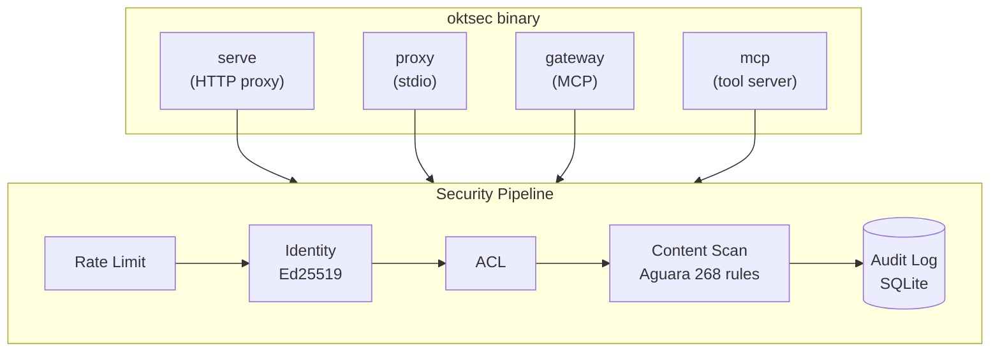
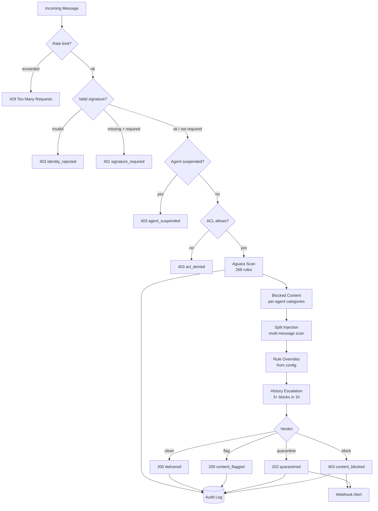
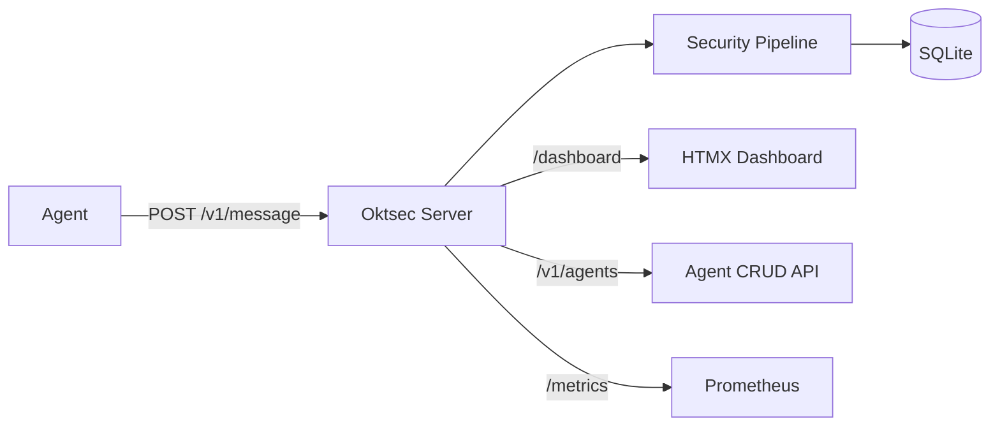
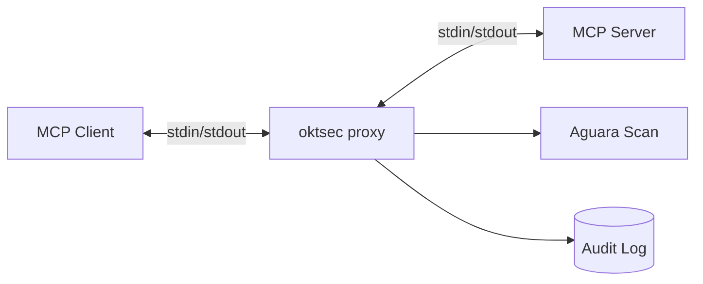
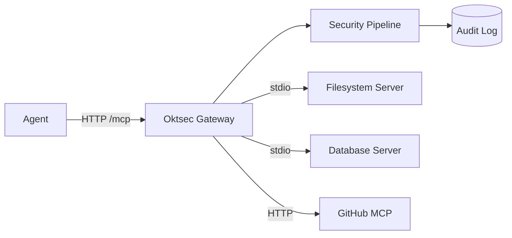
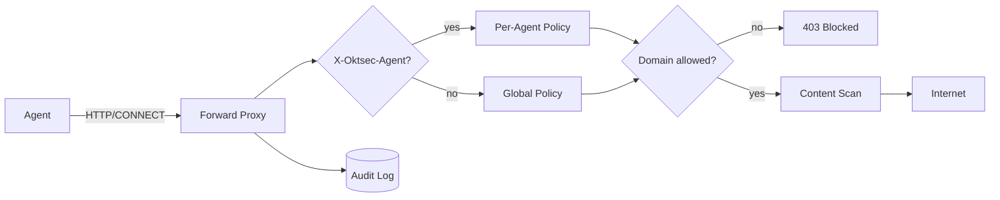

# Architecture

## Overview

Oktsec is a single Go binary with no CGO dependencies. It operates in four modes, all sharing the same security pipeline.



## Package layout

```
cmd/oktsec/commands/     Cobra CLI entry point
internal/
  proxy/                 HTTP proxy, stdio wrapper, forward proxy, agent CRUD API
  gateway/               MCP gateway fronting backend servers
  engine/                Aguara detection engine wrapper
  audit/                 SQLite audit trail + quarantine queue
  identity/              Ed25519 keypair management
  config/                YAML config loading/validation
  policy/                ACL evaluator
  dashboard/             HTMX web UI (server-rendered)
  mcp/                   MCP tool server (6 security tools)
  discover/              Auto-discovers MCP clients on the machine
  auditcheck/            41 deployment audit checks (SARIF output)
  graph/                 Agent topology + threat scoring
  mcputil/               Shared MCP utilities
  safefile/              SSRF/symlink-safe file I/O
rules/                   Detection rule YAML files (embedded via embed.go)
sdk/                     Go SDK client
sdk/python/              Python SDK
```

## Security pipeline detail

The pipeline in `internal/proxy/handler.go` runs checks from cheapest to most expensive. If any check fails, the message is rejected immediately — no further processing.



## Data flow by mode

### HTTP proxy (`serve`)

The main mode. Agents send JSON messages via REST API. Dashboard and agent CRUD API are co-hosted.



### Stdio proxy (`proxy`)

Wraps an MCP server process. Sits between the MCP client and server, intercepting JSON-RPC 2.0 messages on stdin/stdout.



### MCP gateway (`gateway`)

Fronts multiple backend MCP servers through a single Streamable HTTP endpoint. Auto-discovers tools from all backends.



### Forward proxy (egress)

HTTP forward proxy for outbound agent traffic. Supports per-agent domain policies and DLP scanning.



## Key design decisions

**No CGO**
:   All dependencies are pure Go. Cross-compilation to Linux, macOS, Windows on amd64 and arm64 works out of the box. The SQLite driver is `modernc.org/sqlite` (pure Go translation of SQLite C code).

**Official MCP SDK**
:   Uses `modelcontextprotocol/go-sdk` (Tier 1, Linux Foundation governance, semver stability). Migrated from community `mark3labs/mcp-go` for long-term support.

**Embedded rules**
:   Detection rules are compiled into the binary via `rules/embed.go`. No external files to deploy or manage. Custom rules can be loaded from a directory at runtime.

**Cheapest checks first**
:   The pipeline runs rate limiting (~1ns) before signature verification (~120us) before content scanning (~8ms). This minimizes wasted CPU on rejected messages.

**Batched audit writes**
:   The SQLite audit store batches inserts for ~90K writes/sec throughput. Queries use 24-hour time windows with covering indexes for <6ms latency at 1M+ rows.

## Performance

| Metric | Value |
|--------|-------|
| Audit write throughput | ~90K inserts/sec (batched) |
| Handler throughput (clean) | ~52 msg/sec per core |
| Handler throughput (malicious) | ~127 msg/sec per core |
| Signature verification | ~120us |
| Query latency at 1M rows | <6ms |
| Binary size | ~30 MB |
| Memory at idle | ~25 MB |
