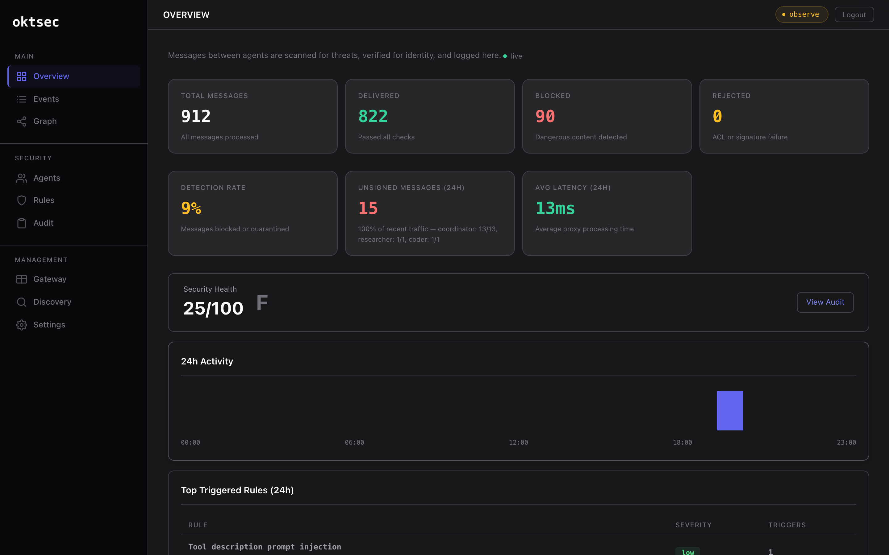
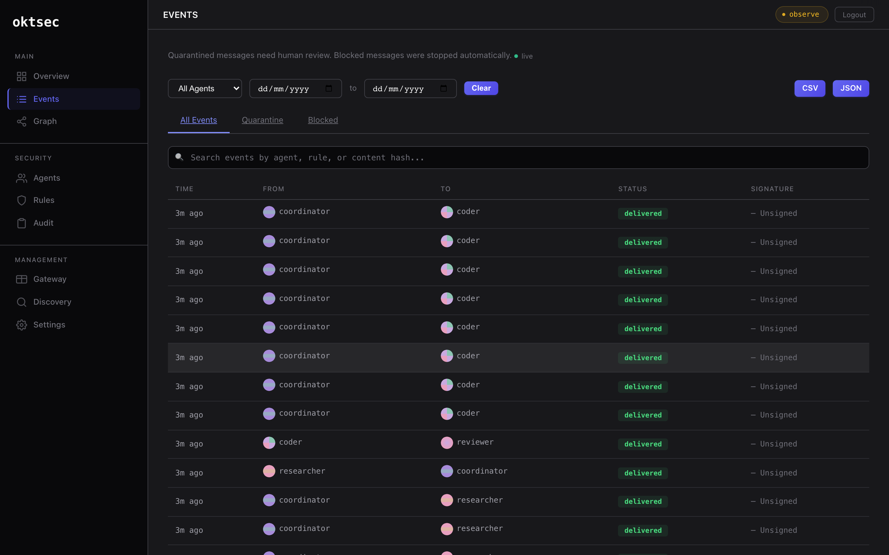
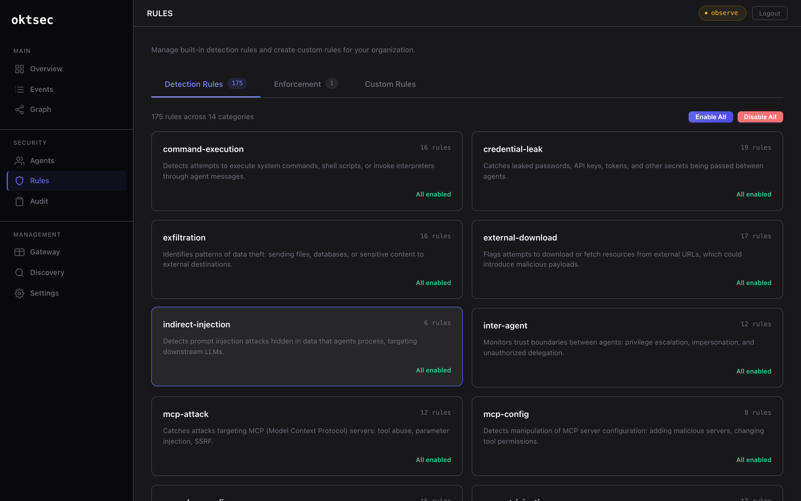
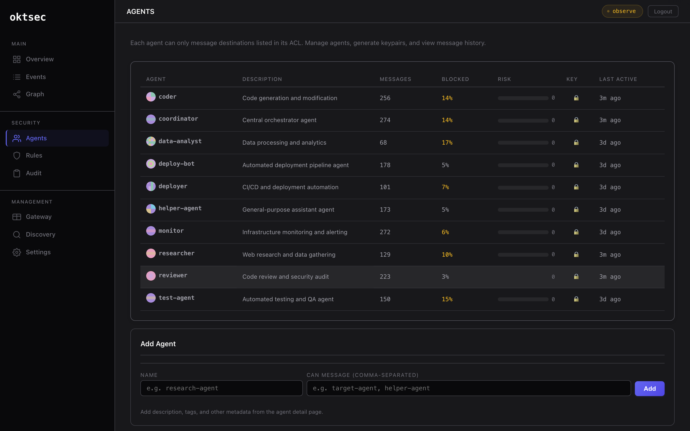
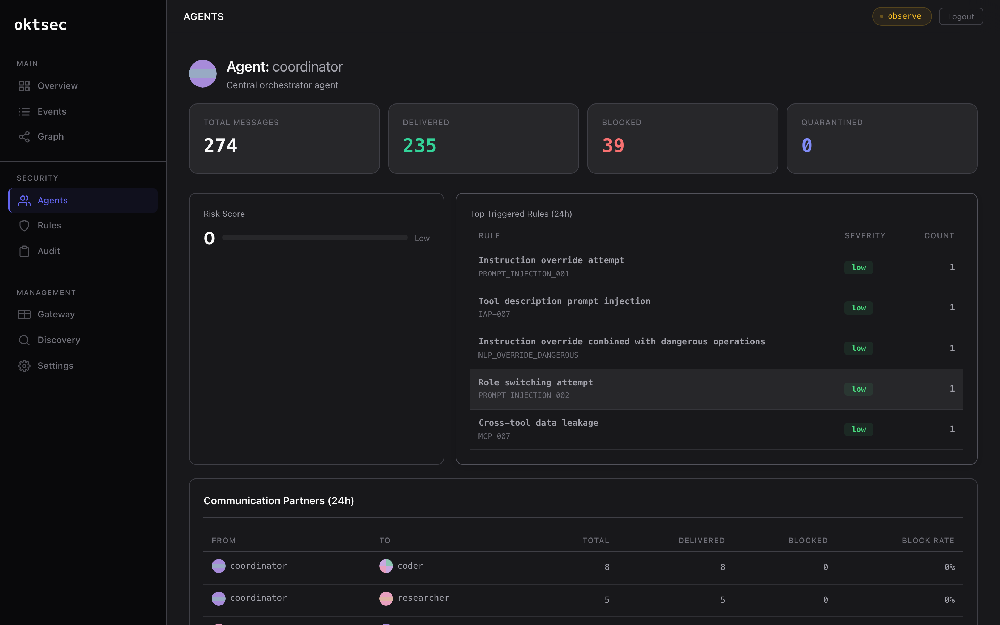
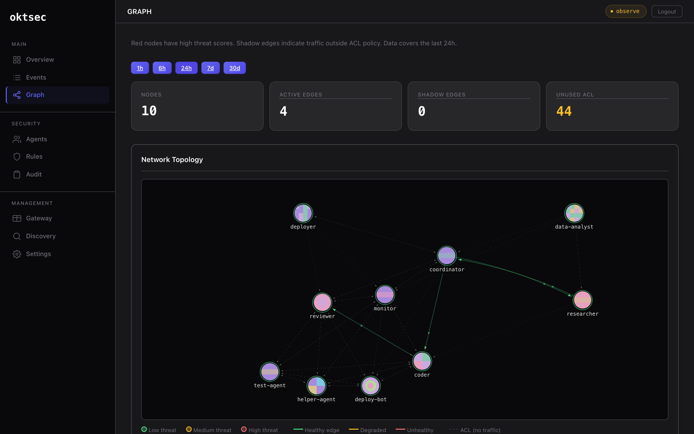
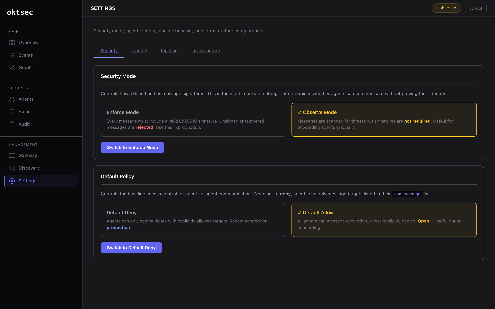
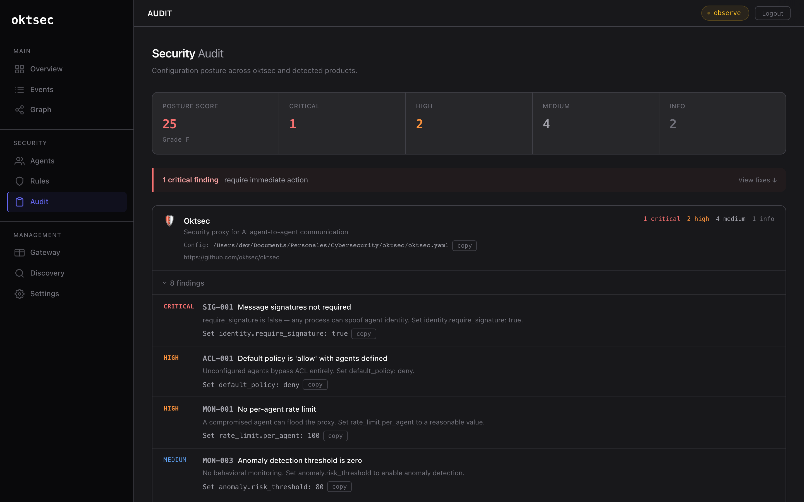
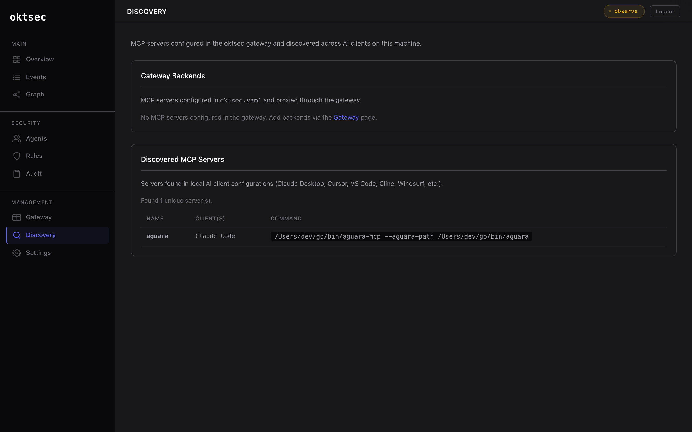

# Dashboard

The Oktsec dashboard is a real-time web UI for monitoring agent activity, managing rules, and responding to security events. It's built with HTMX and server-rendered templates — no external JavaScript frameworks, no CDN dependencies.

```bash
oktsec serve
# Dashboard: http://127.0.0.1:8080/dashboard
```

## Authentication

The dashboard is protected by a **session access code** — a random 8-digit code generated fresh each time the server starts. It's printed in the terminal output:

```
  Access code:  48970966
```

Sessions expire after 8 hours. The server binds to `127.0.0.1` by default (localhost only).

---

## Overview

The landing page shows a real-time summary of your security posture.



**Stats grid** — Total messages, blocked, quarantined, flagged counts at a glance.

**Detection metrics** — Detection rate percentage, unsigned message ratio, average pipeline latency.

**Top triggered rules** — Which detection rules fire most often, with severity indicators.

**Agent risk scores** — Per-agent risk scoring based on recent block/quarantine history.

**Activity chart** — Hourly message volume with verdict breakdown (delivered, flagged, quarantined, blocked).

The overview is mobile-responsive with a hamburger menu for navigation on small screens.

---

## Events

Unified view of all audit log entries and quarantine items with live Server-Sent Events (SSE) streaming.



**Tab filters** — Switch between All, Quarantine, and Blocked views.

**Live streaming** — New events appear in real time without refreshing.

**Event detail panels** — Click any event to expand full details: sender, recipient, content hash, triggered rules, latency, signature status.

**Rule cards** — Clickable rule badges that link to the rule detail page.

**Search and filters** — Filter by agent, date range, or status.

### Quarantine review

Quarantined messages can be approved or rejected directly from the Events page:

- **Approve** — delivers the message to the recipient
- **Reject** — permanently blocks the message

Items auto-expire after `quarantine.expiry_hours` (default: 24h).

---

## Rules

Category-based rule management with drill-down to individual rules.



**Category cards** — 15 categories displayed as cards with rule counts and severity breakdown. Click a category to see all rules in it.

**Rule detail page** — Full rule information including pattern, severity, description, true/false positive examples.

**Inline testing** — Test content against a specific rule directly in the browser.

**Per-rule enforcement** — Override the default verdict for any rule:

- **Block** — always reject messages matching this rule
- **Quarantine** — hold for human review
- **Allow and flag** — deliver but log as flagged
- **Ignore** — disable the rule entirely

**Webhook notifications** — Configure per-rule and per-category webhook channels with custom Slack/Discord templates:

```
*{{RULE}}* — {{RULE_NAME}}
Severity: {{SEVERITY}} | Category: {{CATEGORY}}
Agents: {{FROM}} -> {{TO}}
Match: `{{MATCH}}`
```

**Custom rules** — Create org-specific detection rules from the dashboard using the Aguara YAML schema.

---

## Agents

Agent CRUD with full lifecycle management.



**Agent list** — All agents with status (active/suspended), description, tags, and key status.

**Agent detail** — Full agent configuration, recent activity, and management controls.



**Management actions:**

- **Edit** — update description, ACLs (`can_message`), location, tags, blocked content categories, tool allowlists
- **Keygen** — generate a new Ed25519 keypair for the agent
- **Suspend/Unsuspend** — immediately block all messages from/to this agent
- **Delete** — remove the agent from the config

All changes are persisted to `oktsec.yaml` automatically.

---

## Graph

Agent communication topology visualization.



**Deterministic layout** — Agents positioned consistently based on their name hash.

**Traffic health** — Edge colors indicate traffic health (green = clean, yellow = flagged, red = blocked).

**Threat scores** — Per-agent threat scoring using betweenness centrality — agents that relay many messages are higher risk.

**Shadow edges** — Dotted edges show message attempts that violated ACL policies (agent tried to message someone they're not authorized to reach).

**Edge drill-down** — Click any edge to see message history between two agents.

---

## Settings

Tabbed configuration interface.



**Security mode** — Toggle between enforce (require signatures) and observe (accept all) mode.

**Key management** — View all registered keypairs, rotate or revoke keys.

**Quarantine config** — Set expiry hours and retention days.

**Webhook channels** — Create and manage named webhook endpoints (Slack, Discord, custom). Referenced by name in rule notifications.

**Config editor** — Full YAML config editing with validation.

---

## Audit

Deployment security posture assessment.



**Health score** — 0-100 score with letter grade (A-F) based on your deployment configuration.

**Finding cards** — Per-product findings (Oktsec, OpenClaw, NanoClaw) with severity breakdown and inline remediation guidance.

**Priority fixes** — Top issues sorted by severity with actionable fix instructions.

41 checks across three products, covering config security, key management, network exposure, and access controls.

---

## Discovery

MCP client discovery results.



Shows all detected MCP clients on the machine with their configured servers, tool lists, and wrap status.

---

## Mobile support

The dashboard is fully responsive. On mobile devices:

- Navigation collapses to a hamburger menu
- Stats grid stacks vertically
- Tables become scrollable
- Charts resize to fit the viewport
