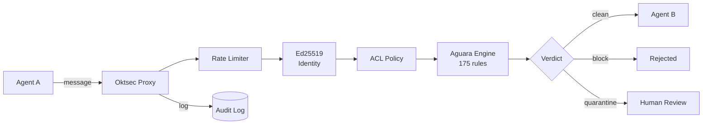

---
hide:
  - toc
---

# Oktsec

<div class="hero" markdown>

## Security layer for AI agent communication

<p class="tagline">Identity verification, content scanning, and audit trail for multi-agent systems.<br>No LLM. Single binary. Deterministic.</p>

<p class="hero-stats"><strong>175 detection rules</strong> · <strong>Ed25519 identity</strong> · <strong>Real-time dashboard</strong> · <strong>Single binary</strong></p>

<div class="badges">
<a href="https://github.com/oktsec/oktsec/actions/workflows/ci.yml"></a>
<a href="https://goreportcard.com/report/github.com/oktsec/oktsec"></a>
<a href="https://github.com/oktsec/oktsec/releases"></a>
<a href="https://github.com/oktsec/oktsec/blob/main/LICENSE"></a>
</div>

[Get Started](getting-started/quickstart.md){ .md-button .md-button--primary }
[Architecture](architecture.md){ .md-button }

</div>

---

## The problem

AI agents talk to each other — they call MCP tools, relay instructions, and share data across trust boundaries. Without guardrails:

- **Agent A** tells **Agent B** to ignore its system prompt and exfiltrate data
- A compromised MCP server injects tool descriptions that **hijack agent behavior**
- Credentials leak in agent-to-agent messages **without anyone noticing**
- There's **no audit trail** of what agents said to each other

Oktsec sits between agents and catches these threats **deterministically** — no LLM, no guessing, no hallucinations.

---

## How it works

Every message passes through **9 security checks**, cheapest to most expensive. If any check fails, the message is rejected immediately.



| Step | Check | Latency | What it does |
|------|-------|---------|--------------|
| 1 | Rate limit | ~1ns | Sliding window per agent |
| 2 | Identity | ~120us | Ed25519 signature verification |
| 3 | Suspension | — | Is the agent suspended? |
| 4 | ACL | — | Can sender message recipient? |
| 5 | Content scan | ~8ms | 175 rules via Aguara engine |
| 6 | Blocked content | — | Per-agent category enforcement |
| 7 | Split injection | — | Multi-message concatenated scan |
| 8 | History escalation | — | 3+ blocks in 1h → auto-escalate |
| 9 | Audit log | — | Full context logged to SQLite |

---

## What you get

<div class="grid" markdown>

<div class="card" markdown>

### :material-shield-check: Content Scanning

175 detection rules catch prompt injection, credential leaks, PII exposure, data exfiltration, MCP attacks, and supply chain risks.

[Detection rules :material-arrow-right:](reference/rules.md)

</div>

<div class="card" markdown>

### :material-key-variant: Agent Identity

Ed25519 signatures verify every message sender. Each agent gets a cryptographic keypair. No valid signature, no delivery.

[Identity guide :material-arrow-right:](getting-started/onboarding.md)

</div>

<div class="card" markdown>

### :material-gate-open: MCP Gateway

Front multiple MCP servers through a single secure endpoint. Auto-discovers tools, namespaces conflicts, scans every tool call.

[Gateway guide :material-arrow-right:](guides/gateway.md)

</div>

<div class="card" markdown>

### :material-monitor-dashboard: Real-time Dashboard

Live event streaming, agent topology graph, threat scoring, quarantine queue, inline rule testing, and full config management.

[Dashboard guide :material-arrow-right:](guides/dashboard.md)

</div>

<div class="card" markdown>

### :material-web-off: Egress Control

Per-agent outbound traffic policies — domain allowlists, DLP category blocking, rate limiting. Know what your agents send out.

[Egress DLP :material-arrow-right:](use-cases/egress-dlp.md)

</div>

<div class="card" markdown>

### :material-api: Full API

Agent CRUD, message pipeline, quarantine management, Prometheus metrics, MCP tool server. Everything programmable.

[API reference :material-arrow-right:](reference/api.md)

</div>

</div>

---

## Four ways to deploy

=== "HTTP Proxy"

    The main mode. Agents send messages via REST API. Full security pipeline with dashboard.

    ```bash
    oktsec serve
    ```

    ```bash
    curl -X POST http://localhost:8080/v1/message \
      -H "Content-Type: application/json" \
      -d '{"from":"agent-a","to":"agent-b","content":"Analyze the report"}'
    ```

=== "Stdio Proxy"

    Wraps individual MCP servers. Intercepts JSON-RPC 2.0 on stdin/stdout.

    ```bash
    oktsec proxy --agent filesystem -- npx @mcp/server-filesystem /data
    ```

    Blocked tool calls return JSON-RPC errors:

    ```json
    {"jsonrpc":"2.0","id":42,"error":{"code":-32600,"message":"blocked by oktsec: IAP-001"}}
    ```

=== "MCP Gateway"

    Fronts multiple backend MCP servers through a single Streamable HTTP endpoint.

    ```bash
    oktsec gateway
    ```

    ```yaml
    mcp_servers:
      filesystem:
        transport: stdio
        command: npx
        args: ["-y", "@modelcontextprotocol/server-filesystem", "/tmp"]
      github:
        transport: http
        url: https://api.github.com/mcp
    ```

=== "MCP Tool Server"

    Expose security operations as MCP tools for AI agents to use directly.

    ```bash
    oktsec mcp
    ```

    Tools: `scan_message`, `list_agents`, `audit_query`, `get_policy`, `verify_agent`, `review_quarantine`

---

## Supported platforms

| Platform | Discover | Wrap | Scan |
|----------|:--------:|:----:|:----:|
| Claude Desktop | :material-check: | :material-check: | :material-check: |
| Cursor | :material-check: | :material-check: | :material-check: |
| VS Code | :material-check: | :material-check: | :material-check: |
| Cline | :material-check: | :material-check: | :material-check: |
| Windsurf | :material-check: | :material-check: | :material-check: |
| Amp | :material-check: | :material-check: | :material-check: |
| Gemini CLI | :material-check: | :material-check: | :material-check: |
| JetBrains | :material-check: | :material-check: | :material-check: |
| OpenClaw | :material-check: | [via gateway](guides/openclaw.md) | :material-check: |
| NanoClaw | :material-check: | via gateway | :material-check: |

---

## Quick start

```bash
# Install
curl -fsSL https://raw.githubusercontent.com/oktsec/oktsec/main/install.sh | bash

# One-command setup — discovers MCP servers, generates config, wraps everything
oktsec setup

# Start proxy + dashboard
oktsec serve
```

Open `http://127.0.0.1:8080/dashboard` with the access code printed in your terminal.

[Full quick start guide :material-arrow-right:](getting-started/quickstart.md){ .md-button .md-button--primary }
[View use cases :material-arrow-right:](use-cases/index.md){ .md-button }
